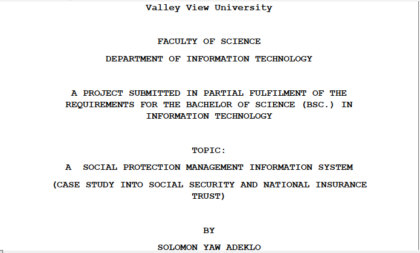
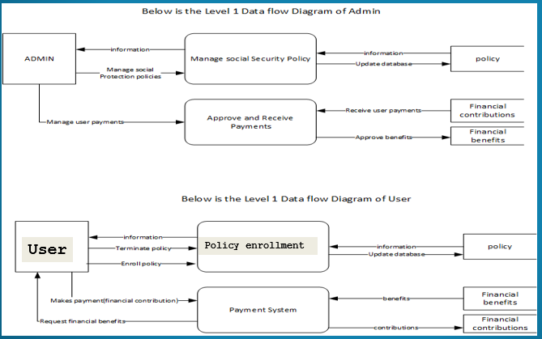

# Final-Year-Project

A social protection management Information System

Read full project document here => <a target="_blank" href=" https://www.researchgate.net/publication/368662756_A_SOCIAL_PROTECTION_MANAGEMENT_INFORMATION_SYSTEM_CASE_STUDY_INTO_SOCIAL_SECURITY_AND_NATIONAL_INSURANCE_TRUST?_sg=XOZAG7e30u0GnKocUElBuxRImSgH-yGPjWBUOg43Un3NLQrtyByrmzFaC5DXuAm0Bsh97t0ot6jmQtm9Hq1yf2P1VLQ&_tp=eyJjb250ZXh0Ijp7ImZpcnN0UGFnZSI6Il9kaXJlY3QiLCJwYWdlIjoiX2RpcmVjdCJ9fQ">Final Year Project</a>

This project is not opensource so I decided not to make the source code public.

This repository contains the documentation of my Final Year Project which involved a research work to develop a social protection management information system to register potential members online to make contributions into social security schemes and to provide social assistance to beneficiaries of the scheme via a secure web portal. This thesis was based on a case study into how the social security system works in a developing country such as Ghana.

Biography of my project supervisor 👇https://vvu.edu.gh/index.php/lms/teachers/teacher/prince-yaw-owusu-amoako

As at August 2017, SNNIT’s pension scheme had a registered membership of about 1,3007,882. That means out of a total population of 30 million Ghanaians,  only 4.36% of the population are enrolled into the government’s social security scheme.
 Since 80% of  the  working population are informal workers, it implies that the chunk of the working population are not targeted  and  enrolled into social protection policies instituted by the government of Ghana. Therefore there is the need
 to develop a social protection management systems to bridge the huge gap in enrollment

This is to declare that, the research work underlying this
thesis has been carried out by the under mentioned student under
the supervisor. Both student and the supervisor certify that
the work documented in this thesis is the output of the research
conducted by the student as part of his final year project
work in partial fulfillment of the requirement of the
Bachelor of Science in Information Technology degree.

STUDENT: SOLOMON YAW ADEKLO (http://solomonadeklo.me/)                                     

SUPERVISOR: MR. PRINCE OWUSU AMOAKO

I published a tutorial on youtube on a review of my Final Year Project . I had to do a presentation of all the core features of the system. I disabled the web screen reader feature in order to prevent conflicting sounds when I speak via the microphone.Click on the image below to watch video 👇👉 https://www.youtube.com/watch?v=wgXSkkYlIoA

 

# Below is the Data Flow Diagram for the system

                           
